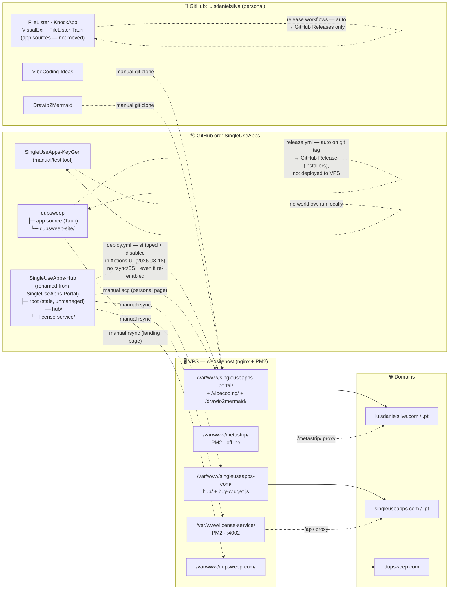

# SingleUseApps — Payment, Key Generation & Multi-Site Plan

Plan for turning the manual license-key process (currently the standalone `SingleUseApps-KeyGen` desktop tool) into a real, paid, self-service flow — and restructuring the single Portal site into a multi-domain product line (Apps Hub + one site per app, starting with DupSweep).

Status: **built and live in Stripe test mode** (2026-08-18). The original goal is shipped except go-live (live Stripe keys), DupSweep screenshots, and PayPal (on hold). Earlier sections below still contain the build log in past-present mix; treat **§12 and this status block** as the source of truth for what is current.

**Current snapshot (2026-08-18):**
- **GitHub org `SingleUseApps`** holds `SingleUseApps-Hub` (this repo; local folder is still named `SingleUseApps-Portal`), `dupsweep` (app + `dupsweep-site/`), and `SingleUseApps-KeyGen`. Personal site is **not** in any repo. `FileLister` / `KnockApp` / `VisualExif` / `FileLister-Tauri` stayed under the personal account.
- **Live sites:** `luisdanielsilva.com` (personal page, deployed by hand to the VPS), `singleuseapps.com` (Apps Hub; `.pt` redirects here), `dupsweep.com` (landing page + Buy Widget).
- **license-service** is on the VPS (PM2 `:4002`, nginx `/api/` on `singleuseapps.com`). Algorithm, salts, Stripe test checkout, webhook, key DB, and email are server-side. A real browser test-mode purchase issued a key.
- **VPS deploys are manual** (`rsync` / `scp`). Hub GitHub Actions (`deploy.yml`, `test-connectivity.yml`) are **stripped to no-ops and disabled** in the Actions UI — a Run workflow click cannot reach the VPS or overwrite the personal page. Do not re-enable them. Do not rsync this repo's root `index.html`/`script.js`/`style.css` to `luisdanielsilva.com`.

---

## 1. Goal

Port the key-generation algorithm from the private repo `SingleUseApps/SingleUseApps-KeyGen` (transferred from `luisdanielsilva/SingleUseApps-KeyGen` on 2026-08-17; a standalone PySide6 desktop tool used to manually issue keys — stays as-is, for manual/test issuance) into a real web flow: a customer pays, and a valid license key is generated and delivered automatically.

## 2. Site structure

The original single-Portal model is superseded by a multi-domain structure:

- **`luisdanielsilva.com`** — personal site (portfolio/about). No payment or key logic here.
- **Apps Hub** — `singleuseapps.com` (with `singleuseapps.pt` redirecting to it, mirroring the existing `luisdanielsilva.pt` → `.com` pattern). Shows all apps; hosts the shared checkout flow.
- **Per-app marketing sites** — one domain per app, each a lightweight landing page (screenshots, features, download, buy). First one: **DupSweep** at `dupsweep.com`.

## 3. Architecture diagram


**Reading it:** solid arrows are the customer purchase flow (browse → pay inline → webhook confirms → key generated, stored, emailed). Dotted arrows are account-admin traffic (service signups/alerts) landing in the dedicated support inbox, kept separate from both the customer flow and any personal email.

## 4. License key algorithm

Ported from `keygen_app.py`:

```
seed      = 20 random chars from [A-Z0-9]
signature = SHA256(seed + email.lower().strip() + SALT).hex().upper()[:6]
key       = "XXXX-XXXX-XXXX-XXXX-XXXX-SIGSIG"   (seed in 5 groups of 4, then the signature)
```

- Per-app `SALT_MAP` values carry over unchanged, so keys stay compatible with however the apps currently validate them offline.
- **Fixed:** the old Portal `script.js` used a **4-char** signature (`hashHex.substring(0,4)`). `license-service` and DupSweep's validator now agree on **6 chars**.
- **Fixed:** `SALT_MAP` and the algorithm no longer ship in public client code. Salts live in VPS env vars only. The old client-side keygen and fake `simulatePayment()` were removed.

## 5. Payments

- **Stripe test path is live.** PayPal is still on hold. The old Portal's fake `simulatePayment()` (`setTimeout`, no payment check) is gone.
- Real, webhook-verified confirmation before any key is issued.
- **Stripe test keys obtained (2026-08-16).** Publishable key: `pk_test_51U4kTtRpCbAHfa5oo6iUWnaqJpYsfaX6kOiHlXrw4RffpOuo5kiL5YvdKPVSUOR0viCXUnTb3kaSi5KlFeMe5zay00y9FPsJve` (safe to embed in frontend code). The matching secret key is **not** recorded in this file — it lives in the VPS `.env` as `STRIPE_SECRET_KEY`. Webhook signing secret (`whsec_...`) is also on the VPS as `STRIPE_WEBHOOK_SECRET` (registered 2026-08-16 against the live `/api/webhooks/stripe` endpoint).
- **PayPal on hold (2026-08-16):** deferred until the Stripe path was proven end-to-end. That Stripe path is now proven in test mode; PayPal is still not started.
- **Pricing confirmed (2026-08-16):** 5€ for a lifetime license — same model as the current apps, applies to DupSweep too. Implemented as a **flat 5€ price**, not adjustable "pay what you want" — Stripe Checkout Sessions don't accept `custom_unit_amount` inline (needs a pre-created `Price` object); user confirmed flat 5€ is fine, adjustable pricing is a possible future refinement, not planned work now.
- **Still needed for go-live:** Stripe **live** keys and a live webhook endpoint (replace the test ones). PayPal credentials only if/when PayPal is picked back up.

## 6. Shared "Buy Widget"

Payment is implemented **once**, embedded on every site so it feels native to each domain instead of redirecting visitors elsewhere:

- **Built:** one JS widget (`license-service/public/buy-widget.js`), served from `singleuseapps.com`, included via a `<script>` tag + per-site config (`data-app`, `data-price-label`, `data-accent`). Embedded on the Hub and `dupsweep.com`.
- Stripe Embedded Checkout renders inline so the visitor never leaves the app's own domain. PayPal Smart Buttons were part of the original sketch; not implemented (on hold).
- Every instance calls the same License Service API — one implementation, reused everywhere, only skinned per-site via config.
- CORS allow-list on the License Service per known app domain — a config addition per new domain, not new code.
- No separate widget repo (decision 2026-08-17). Lives as a static file next to `license-service`.

## 7. Backend — License Service

**Location decision (2026-08-16):** built as a `license-service/` subfolder inside this repo (then still named `SingleUseApps-Portal`). The GitHub org migration happened later (2026-08-17, see §10); `license-service` stayed in `SingleUseApps-Hub` rather than becoming its own repo. Can still be split out later without losing history.

**Scope decision (2026-08-16):** Stripe-only for the first working version — PayPal is on hold until Stripe is proven end-to-end (see §5). The backend's internal `issueKey()` function is provider-agnostic, so adding PayPal later only means a second checkout/webhook route, not a rewrite.

### Implementation plan

**Phase 1 — backend core — ✅ built and tested (2026-08-16)**
1. `license-service/` — Node + Express app (ESM).
2. Ported the algorithm (`seed` + `SHA256(seed+email+salt)[:6]`) server-side (`src/algorithm.js`), reading salts from env only (`src/apps.js`) — never committed, since this repo is public. DupSweep's salt (`DupSweep-Secret-Salt-2026-Sweep`) confirmed matching its Rust validator (see the algorithm-fix note below).
3. SQLite DB (`better-sqlite3`, `src/db.js`): `email, name, appId, provider, payment_ref, key, created_at` — `payment_ref` unique; dedupe verified by calling `issueKey()` twice with the same ref and confirming the identical key comes back both times.
4. Endpoints (`src/routes/`):
   - `POST /api/checkout/stripe` — creates a real Stripe **test-mode** Checkout Session (verified with an actual API call, not just written), returns `clientSecret`.
   - `POST /api/webhooks/stripe` — signature-verified (confirmed a bad signature returns 400 without crashing the server); on `checkout.session.completed`, runs `issueKey()`.
   - `GET /api/license/:sessionId` — confirmed returns `{status:"pending"}` for an unknown session.
5. CORS allow-list: `dupsweep.com`, `singleuseapps.com`.
6. Env vars (`.env`, gitignored — confirmed via dry-run `git add` that only safe files would be staged): `STRIPE_SECRET_KEY` (test), `STRIPE_WEBHOOK_SECRET` (still needed — see Phase 2), `RESEND_API_KEY`, per-app salts.

**Bugs caught and fixed during testing (not just written blind):**
- Stripe rejected `custom_unit_amount` inline on `price_data` — that's a `Prices` API concept needing a pre-created Price object, not accepted per-session. **Decision: flat 5€ price**, not adjustable "pay what you want" — user confirmed flat 5€ is fine; true customer-adjustable pricing remains a possible future refinement, not planned work now.
- The webhook route's raw-body parser was initially mounted globally under `/api`, which would have broken JSON parsing on the checkout/license routes — caught and scoped to just `/api/webhooks/stripe` before committing.

**Cross-implementation check:** a key generated by `license-service` was independently verified in Python to have the exact expected signature — confirming `license-service` (JS), `keygen_app.py` (Python), and DupSweep's Rust validator all agree on the identical algorithm.

**Phase 2 — deployment — complete (2026-08-16)** (VPS live; GitHub Actions for this path never automated — see §12)

DNS: added the missing A record for `singleuseapps.com`/`www` → the VPS IP in Cloudflare, confirmed resolving.

**Sudo access note:** the `deploy` user's passwordless sudo was tightly scoped to only the 3 commands the original `deploy.yml` needed — nothing for this phase (new directories, nginx config, certbot) was covered, and there's no way to run arbitrary sudo commands over SSH without an interactive password. Resolved by widening `/etc/sudoers.d/license-service` with a new NOPASSWD entry scoped to exactly the commands this phase needs (not blanket sudo) — a one-time manual `visudo` edit. Two path-matching snags along the way, both just sudoers-file fixes: sudoers matches commands as exact strings (so a two-path `mkdir -p a b` didn't match single-path whitelist entries — had to run each separately), and `nginx` is actually at `/usr/sbin/nginx`, not `/usr/bin/nginx`.

**Completed and verified from outside (not just assumed):**
7. `/var/www/license-service` and `/var/www/singleuseapps-com` created, owned by `deploy:www-data`.
8. nginx server block + Let's Encrypt cert for `singleuseapps.com` — cert obtained via `certbot certonly --nginx` (obtain-only, not the auto-config-edit mode), then the full config hand-written to match the existing `singleuseapps-portal` config's style, with `location /api/` proxying to `127.0.0.1:4002`, plus an HTTP→HTTPS redirect block. Config backup taken first (`~/backups/nginx-backup-*.tar.gz` on the VPS — `deploy` can't write to `/root`).
   - Verified externally: valid cert (`CN=singleuseapps.com`), HTTP→HTTPS 301 redirect works, `www` variant works, `/api/health` returns 502 (proves the proxy is correctly wired to the not-yet-deployed service on port 4002, not a config error).

9. Deployed the code (`rsync`, excluding secrets/deps/data) + `.env` created directly on the VPS + `npm install --omit=dev` + PM2. `ecosystem.config.js` had to become `ecosystem.config.cjs` (PM2 can't `require()` an ESM file, and this package is `"type": "module"`) — fixed in the source repo, not just patched remotely.
10. Registered the real Stripe webhook via the API (no dashboard needed) → `STRIPE_WEBHOOK_SECRET` added to the VPS `.env`, service restarted.
    - **Bug caught and fixed:** nginx's `proxy_pass` had a trailing slash, which strips the `/api/` prefix before forwarding — Express still expected it, so every request 404'd. Fixed by dropping the trailing slash.
    - **Verified live with real calls:** `/api/health` and `/api/checkout/stripe` both work through the production URL (a real Stripe test-mode session was created). Installed the Stripe CLI and ran `stripe trigger checkout.session.completed` against the live endpoint — confirmed via server logs that webhook **signature verification passed** on a real Stripe-signed event, and the handler correctly rejected it for missing custom metadata (expected, since the CLI's generic fixture doesn't carry our `appId`/`email`) without crashing.
11. **Not automated, by choice:** GitHub Actions for `license-service/**` deploys was never built. Deploys stay manual. The old root `deploy.yml` is no longer a fallback — stripped and disabled 2026-08-18 (see §12).

**Phase 3 — complete (2026-08-16)**

Reused the existing, already-live Portal support-form instead of a separate throwaway test page — this also directly satisfied the long-standing "remove old client-side key-gen code" checklist item.

12. `checkout.js`: `return_url` now derived from the request's Origin header rather than hardcoded to `singleuseapps.com`, so this works regardless of which allowed domain the Portal currently lives on. Added `luisdanielsilva.com`/`www` to `ALLOWED_ORIGINS` (temporary, since that's where the Portal deploys today).
13. `index.html`/`script.js`: removed all client-side key generation (`SALT_MAP`, `calculateSignature`) and the fake `simulatePayment()`. Form now collects name/email/app first; "Pay with Stripe" calls `/api/checkout/stripe` and mounts Stripe's real Embedded Checkout inline; on return (`?session_id=...`), polls `/api/license/:sessionId` until ready. PayPal button removed from the UI for now.
14. **Ran a full, real, browser-driven Stripe test-mode purchase** — confirmed correct 5€ charge, webhook fired, and a real key was issued and displayed. This is the first genuine end-to-end proof of the whole chain (Stripe CLI's earlier `trigger` only tested webhook plumbing in isolation, not a real user checkout).

**Deployment hiccup found (unrelated to this work) (2026-08-16):** GitHub Actions deploy had been intermittently failing since 2026-08-15 evening. Deployed manually via `rsync` over the existing SSH access to unblock testing in the meantime. Chased through several layered problems:
1. Expired `TAILSCALE_AUTHKEY` — fixed by regenerating a new key in the Tailscale admin console (reusable + ephemeral + longest expiry) and updating the GitHub secret.
2. Pushing the workflow-file fix itself needed `gh auth refresh -s workflow` first (missing OAuth scope for editing `.github/workflows/*`).
3. Even with a valid key, the ephemeral runner showed intermittent packet loss reaching the VPS over Tailscale right after joining. Ruled out Tailscale ACL (checked — wide open) and fail2ban (checked — zero bans). Added retry loops + `ConnectTimeout=15` everywhere.
4. **The retry loops had a bug that silently reported success on total failure** (`command && break` — when every attempt fails, the last thing executed is the harmless `sleep`, exit 0). A run genuinely went green while all 15 SSH/rsync attempts across 3 steps failed and the live site was never updated. Fixed to explicitly track success and fail loudly.
5. Even with all of the above fixed, the underlying connectivity is **not just occasional flakiness** — a later run failed all 15 `tailscale ping` attempts outright. This looks like a deeper reliability problem with Tailscale-from-GitHub-hosted-ephemeral-runners (UDP/NAT traversal to the DERP relay can be unreliable from GH's runner IP ranges), not something retry counts alone fix.

**Decision: deploy manually for now, not worth more time chasing this.** My SSH access works reliably every time; automated CI is deprioritized until revisited later, possibly via direct public SSH instead of routing through Tailscale in CI (a real security-posture change, not a quick fix, so not undertaken now).

**Phase 4 — polish — Buy Widget complete (2026-08-17); PayPal still on hold**

15. Build the real, styled, embeddable Buy Widget (Phase 3 reused the Portal's own form directly instead — this is for per-app sites like DupSweep's, per the multi-site plan).
    - **Decided: no separate repo for the widget.** It's one static JS file, not an app with its own dependency/release lifecycle — `license-service` already has a stable deployed domain (`singleuseapps.com`) that can serve it statically alongside the API. Revisit only if it later needs independent versioning/build tooling.
    - **Added purchase-source tracking first**, since it's directly relevant to a multi-site widget: the same widget could be embedded on several sites selling the same app, so `app_id` alone tells you *what* was bought but not *which site* the customer used. Added a `source` column (`license-service`), populated automatically from the same trusted `Origin` header already used for `return_url` — travels through Stripe as session metadata since the webhook only sees that, not the original request. No widget config needed; can't be spoofed by the client. Migration tested against a DB with pre-existing rows (old rows correctly backfill to `source=null`). Verified live with two sessions from two different origins producing two different `source` values.
    - **Built** (`license-service/public/buy-widget.js`): one embeddable script, config via `data-app`/`data-price-label`/`data-accent` on a `.buy-widget` container. Loads Stripe.js itself, injects scoped styles, handles the full flow. Served as a plain static file from nginx's existing `singleuseapps-com` docroot — no Express or nginx changes needed. Exposes `window.SUAWBuyWidget.init(container)` for pages with an app-picker (like the Portal, and the future Hub) to re-render for a newly selected app.
    - `checkout.js` extended: `returnTo` (validated against the trusted Origin) so the widget returns to the exact page it was on, not just the site root; `return_url` now carries `suaw_app` so the widget knows which container to show the result in.
    - **Portal migrated** to use the widget, replacing ~110 lines of Phase-3 page-specific code with a ~6-line dropdown-sync listener. Also fixed `selectApp()` (app-card clicks), which only set the dropdown's value directly and didn't trigger a widget re-render. Orphaned CSS cleaned up.
16. PayPal (on hold).

**Serious deploy-pipeline bug caught and fixed (2026-08-17):** the retry-loop pattern from the earlier Tailscale fix (`command && break`) has a classic shell footgun — when every attempt fails, the last command actually executed is the harmless `sleep 5` (exit 0), so the step (and job) reports **green even though the real command never once succeeded**. This genuinely happened: a run showed "success" while all three SSH/rsync steps failed 5/5 attempts each — the live site was never updated despite the checkmark. Caught by independently verifying live behavior via `curl` rather than trusting the green run. Deployed that commit manually to fix the site immediately, then rewrote every retry loop to explicitly track success and `exit 1` with an `::error::` annotation on total failure, and bumped retries to 10×8s (the flakiness observed can persist for minutes, not just a blip).

**Lesson:** a green checkmark on this pipeline isn't proof of a working deploy under the current Tailscale-from-ephemeral-runner flakiness — worth spot-checking live behavior after pushes that matter.

## 8. Email infrastructure

### DNS → Cloudflare
Nameservers for every relevant domain are moving from **Amen** to **Cloudflare** (free plan). Domains stay *registered* at Amen — only DNS hosting moves. Reasons: free **Cloudflare Email Routing** (below), free CDN/DDoS/WAF for static assets, better DNS management UI (needed anyway for Resend's verification records). Kept in **DNS-only / grey-cloud** mode so the existing nginx + Let's Encrypt/certbot setup on the VPS isn't disrupted.

**Status (2026-08-15): all three domains Active.**
| Domain | Status | Nameservers |
|---|---|---|
| `dupsweep.com` | ✅ Active | `diva.ns.cloudflare.com` / `eugene.ns.cloudflare.com` |
| `singleuseapps.pt` | ✅ Active | `diva.ns.cloudflare.com` / `eugene.ns.cloudflare.com` |
| `singleuseapps.com` | ✅ Active | `hans.ns.cloudflare.com` / `julissa.ns.cloudflare.com` (**different pair** — Cloudflare can assign a distinct pair per domain even in one account; don't assume the same pair applies across domains) |

**Known hiccup:** right after switching nameservers, Cloudflare may flag an "invalid DS record" — Amen's nameserver-change form doesn't actually remove the registry-level DNSSEC DS record despite implying it will. Fix: manually delete the DS record in Amen's DNSSEC section for that domain; clears within a day. Hit this for `dupsweep.com`, did not recur for `singleuseapps.com`.

### Support email — one address per app, one shared inbox
Each app domain gets its own branded address (`support@dupsweep.com`, `support@singleuseapps.com`, and so on for future apps) — better for customer trust than a generic catch-all — but all of them forward into **one** real inbox rather than a separate mailbox per app, so there's only ever one place to check:

1. **Cloudflare Email Routing** (free, unlimited domains) forwards each `support@` address into **`singleuseapp@gmail.com`** — a fresh inbox created solely for this, never the personal one.
2. **Gmail "Send mail as"** (Settings → Accounts) is configured per forwarded address so replies show `From: support@dupsweep.com` etc., not the raw Gmail address.

**Why this instead of a real multi-domain mailbox** (Proton custom domains, Migadu, Google Workspace, Zoho, Fastmail): all of those are paid, and a genuinely free native multi-domain mailbox doesn't really exist as a mainstream product — authenticated hosting for domains you don't own is exactly what those services charge for. Trade-off accepted: without dedicated per-domain DKIM signing, deliverability is a little weaker than a paid host — acceptable at current volume; revisit (e.g. Migadu, ~19€/year, unlimited domains) if that becomes a real problem.

### Implementation status (2026-08-15)

**`dupsweep.com` — fully working, receive + reply-as:**
1. Cloudflare Email Routing enabled. Hit an "Existing non-Cloudflare MX records conflict" error on first activation — a leftover MX record (likely an Amen default/parking record) had been imported into the DNS zone; fixed by deleting it under DNS → Records, then re-activating successfully.
2. Destination `singleuseapp@gmail.com` added and verified (this verification is account-wide in Cloudflare, not per-domain).
3. Routing rule `support@dupsweep.com` → `singleuseapp@gmail.com` created and confirmed working (first test email took several minutes to arrive — normal for freshly-propagated MX records).
4. **Plan correction discovered here:** Gmail's "Send mail as" does **not** offer a plain "send through Gmail" option for an arbitrary custom domain on a personal account — it always requires real SMTP relay credentials. Cloudflare Email Routing is **receive-only**, so the MX host Gmail auto-suggested (`route3.mx.cloudflare.net`) doesn't work as an outbound SMTP relay.
5. **Fix — reused Resend for outbound SMTP too**, rather than adding a new service: signed up at Resend (org `singleuseapp`), added `dupsweep.com` as a domain, added its DNS records (DKIM + a `send.dupsweep.com` MX/SPF pointing at the Amazon SES infrastructure Resend uses) in Cloudflare. Domain shows **Verified** in Resend.
6. Resend SMTP credentials (`smtp.resend.com`, port `587`, username `resend`, password = Resend API key) used in Gmail's "Send mail as" SMTP form for `support@dupsweep.com` — verified successfully.
7. Not yet added: a DMARC record for `dupsweep.com` — optional deliverability improvement, not required for the above to work.

**`singleuseapps.com` — reduced scope, complete.** Discovered Resend's **free plan only supports 1 verified domain**, already used by `dupsweep.com`. Considered: upgrading to Resend Pro (~$20/mo, unlimited domains), a second free Resend account via Gmail plus-addressing (extra logins/API keys to juggle per app going forward), or skipping Send-as for this domain. **Decision: skip Resend/Gmail Send-as for `singleuseapps.com` for now** — zero cost, replies from this inbox just show as `singleuseapp@gmail.com` instead of `support@singleuseapps.com`, acceptable at current volume. Revisit (likely Resend Pro, since the same limit will recur for every future app domain) once it's worth it. So this domain only got steps 1–3 above (Cloudflare Email Routing, receiving only) — no domain verification or Send-as. **Confirmed working (2026-08-15)** — test email received.

**Email infrastructure phase: complete for both current domains.** `dupsweep.com` has full receive + reply-as; `singleuseapps.com` has receive-only (by choice). Both `support@` addresses land in `singleuseapp@gmail.com`. Stripe test path, GitHub org, and `license-service` all landed after this section was first written — see the status block and §12.

## 9. Domains — registered

Bought on Amen.pt (2026-08-15): `dupsweep.com`, `singleuseapps.com`, `singleuseapps.pt`.

**Bug found (2026-08-17) — fixed.** `singleuseapps.pt` wasn't reaching the VPS — it served Amen's default parking page. Fixed in two parts: (1) corrected the Cloudflare A records (`@` and `www`) to the VPS IP, DNS-only — hit a snag where adding the `www` record failed due to a leftover CNAME needing to be edited/deleted first; (2) HTTPS had no dedicated nginx config at all and was silently serving `luisdanielsilva.com`'s certificate (wrong domain, would show a browser warning) — added a new `certbot` cert + nginx block redirecting both HTTP and HTTPS to `https://singleuseapps.com`, matching the existing `luisdanielsilva.pt` → `.com` pattern. Verified live: correct redirect chain, valid cert (`CN=singleuseapps.pt`).

## 10. GitHub organization — built (2026-08-17)

Structure ended up different from the original 5-separate-repos sketch, since `hub/`, `license-service/`, and `dupsweep-site/` evolved into subfolders of one repo rather than splitting out. Went through a real design review before executing:

- Original draft had `dupsweep-site` centralized in the Hub repo — corrected to live **with the DupSweep app** instead ("hub is one thing, each app is another, personal website another").
- Confirmed reversible before proceeding: repo transfers/renames use GitHub's built-in redirects, no data loss either way; only the `dupsweep-site/` file relocation needs manual work to undo.
- `FileLister`/`KnockApp`/`VisualExif`/`FileLister-Tauri` deliberately **left under the personal account** — not touched by this project's work.

**Final structure:**
```
SingleUseApps/  (org)
├── SingleUseApps-Hub    ← transferred + renamed from SingleUseApps-Portal
│   ├── hub/                Apps Hub site
│   └── license-service/    shared backend
├── dupsweep              ← transferred
│   ├── (app source)
│   └── dupsweep-site/      moved here from the Hub repo
└── SingleUseApps-KeyGen  ← transferred, unchanged
```
Personal website stays outside any repo (unchanged decision). `VibeCoding-Ideas`/`Drawio2Mermaid` stay under the personal account.

**Notes from execution:**
- Repo-level secrets (`FTP_*`, `VPS_*`, `TAILSCALE_AUTHKEY`) survived the transfer automatically.
- **Found real uncommitted work before touching the DupSweep repo**: the About-dialog/email-styling feature from earlier had been tested working but never actually committed — merged as PR #4 first.
- Updated DupSweep download links (Hub + DupSweep's own landing page) to the new `SingleUseApps/dupsweep` path; old `luisdanielsilva/DupSweep` links still redirect automatically either way. `FileLister`/`KnockApp`/`VisualExif` links correctly left unchanged since those repos didn't move.

## 11. DupSweep landing page — built and live (2026-08-17)

By the time this got built, `license-service` and the Buy Widget already existed and `dupsweep.com` was already in `ALLOWED_ORIGINS` — so it shipped with a **real, working Buy button** from day one, no placeholder needed.

`dupsweep-site/index.html` — styled after [wishlists-app.com](https://www.wishlists-app.com) (clean, minimalist, teal/coral), adapted: hero, 4-feature grid (real capabilities — no fabricated stats/testimonials, unlike the reference site), platform download badges, real Buy Widget embed. **Built screenshot-free** — user doesn't have DupSweep screenshots yet. **Reminder: add real screenshots once available** (not yet done).

**Real DNS bugs found and fixed getting `dupsweep.com` live:** the domain was Proxied through Cloudflare (not DNS-only like every other domain — broke the certbot ACME challenge outright), the root A record pointed at a stale Amen IP, and `www` had no A record at all (a leftover CNAME to Amen's parking service, also proxied). Fixed all three, then cert + nginx config succeeded.

Verified live: real 200 response, widget renders, and a real Stripe checkout session created successfully from `dupsweep.com`'s actual origin.

## 12. Open items / next steps

- [x] Finish `singleuseapps.com` Cloudflare migration — Active
- [x] Cloudflare Email Routing + Resend SMTP + Gmail "Send mail as" fully working for `support@dupsweep.com`
- [x] Cloudflare Email Routing (receiving only) working for `support@singleuseapps.com`
- [x] Stripe test keys obtained
- [ ] ~~PayPal sandbox + live app credentials~~ — on hold. Stripe test path is already proven; PayPal is still not started.
- [x] Create the `SingleUseApps` GitHub org — built, 3 repos transferred/renamed, `dupsweep-site/` moved into the `dupsweep` repo (see §10)
- [x] Generate a DupSweep salt for `SALT_MAP` — `DupSweep-Secret-Salt-2026-Sweep`
- [x] Fix DupSweep's license algorithm mismatch (2 PRs merged) so it accepts keys `license-service` issues
- [x] Scaffold `license-service/` (Phase 1: algorithm, DB, Stripe checkout + webhook endpoints, CORS) — built and tested with real Stripe test-mode calls
- [x] Deploy `license-service` to the VPS (PM2 + nginx server block/cert for `singleuseapps.com`) — verified live with real Stripe test-mode calls
- [x] Register the Stripe webhook endpoint → `STRIPE_WEBHOOK_SECRET` — signature verification confirmed working on a real Stripe-signed event
- [x] Neutralize Hub GitHub Actions (2026-08-18) — `deploy.yml` and `test-connectivity.yml` are **stripped to no-ops** (no Tailscale, SSH, rsync, or nginx; job `if: false`) and **disabled in the Actions UI** (`disabled_manually`). A leftover "Run workflow" click cannot touch the VPS or overwrite `luisdanielsilva.com`. The old Tailscale-from-ephemeral-runner flakiness is moot. Do **not** re-enable these workflows. Deploys stay manual.
- [ ] Automate `license-service/**` (and `hub/**`) deploys — **not started, not planned** while Hub workflows stay disabled. If ever revisited: a new workflow scoped only to those subfolders, never the repo root (the root would clobber the personal page). Not a next step.
- [x] Confirm pricing — flat 5€ lifetime license, same as existing apps
- [x] Ran a full, real, browser-driven Stripe test-mode purchase end-to-end — confirmed correct 5€ charge, key issued and displayed
- [x] Remove the old client-side `SALT_MAP`/key-gen code and fake `simulatePayment()` from the current Portal
- [x] Build the real shared Buy Widget (`buy-widget.js`) and switch the Portal to use it — confirmed with a real browser purchase on `www.luisdanielsilva.com`
- [x] Build the DupSweep landing page — live at `dupsweep.com`, real Buy Widget working, screenshot-free for now (see reminder below to revisit)
- [x] Build the Apps Hub site at `singleuseapps.com` (`hub/` — adapted from the Portal; FileLister Pro/Tauri removed, DupSweep added, contact form → `singleuseapp@gmail.com`) — deployed manually, verified live
- [x] Fix `singleuseapps.pt`'s DNS + missing HTTPS config — now correctly redirects (HTTP and HTTPS) to `singleuseapps.com` with a valid cert
- [x] Migrate the Portal (`luisdanielsilva.com`) to be purely personal — simple single-viewport profile page (name/title/company/location/education/languages/contact/LinkedIn), sourced from the user's public LinkedIn profile. **Deployed directly to the VPS, intentionally not in Git** (user's explicit choice). ⚠️ This repo's root `index.html`/`script.js`/`style.css` are now stale/unmanaged for `luisdanielsilva.com` — do **not** re-deploy them there, it would silently overwrite the personal page with the old app catalog.
- [ ] Add PayPal once Stripe is proven
- [ ] Go live: swap to live keys/webhooks
- [ ] Add real DupSweep screenshots to its landing page once available (built screenshot-free for now — reminder not to forget this)

## 13. Infrastructure map (living diagram — keep updated as the plan progresses)



**Reading it:** solid boxes are where code/content actually lives; dotted arrows show *how* it gets there and whether that's automatic or manual. **Nothing deploys to the VPS automatically.** Hub Actions are stripped and disabled in the GitHub UI — not merely `workflow_dispatch`-only. Every VPS arrow is a manual `rsync`/`scp`/`git clone`. The only automatic GitHub Actions still running are app repos' release builders, which only publish downloadable installers and never touch the VPS.

*Last updated: 2026-08-18 — plan refreshed to current status: org `SingleUseApps` (`SingleUseApps-Hub` / `dupsweep` / `SingleUseApps-KeyGen`); Stripe test path live; Hub `deploy.yml` + `test-connectivity.yml` stripped to no-ops and disabled in Actions. Local checkout folder is still `SingleUseApps-Portal`.*
