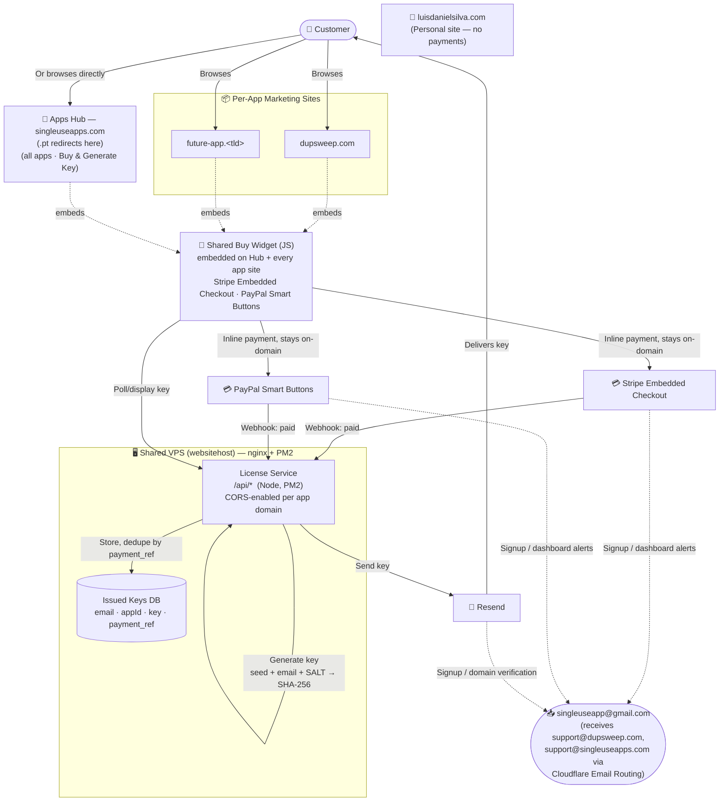

# SingleUseApps — Payment, Key Generation & Multi-Site Plan

Plan for turning the manual license-key process (currently the standalone `SingleUseApps-KeyGen` desktop tool) into a real, paid, self-service flow — and restructuring the single Portal site into a multi-domain product line (Apps Hub + one site per app, starting with DupSweep).

Status: **planning/setup phase** — domains registered and migrating to Cloudflare; no backend code, no org, no landing pages built yet.

---

## 1. Goal

Port the key-generation algorithm from the private repo `luisdanielsilva/SingleUseApps-KeyGen` (a standalone PySide6 desktop tool used to manually issue keys — stays as-is, for manual/test issuance) into a real web flow: a customer pays, and a valid license key is generated and delivered automatically.

## 2. Site structure

The original single-Portal model is superseded by a multi-domain structure:

- **`luisdanielsilva.com`** — personal site (portfolio/about). No payment or key logic here.
- **Apps Hub** — `singleuseapps.com` (with `singleuseapps.pt` redirecting to it, mirroring the existing `luisdanielsilva.pt` → `.com` pattern). Shows all apps; hosts the shared checkout flow.
- **Per-app marketing sites** — one domain per app, each a lightweight landing page (screenshots, features, download, buy). First one: **DupSweep** at `dupsweep.com`.

## 3. Architecture diagram



**Reading it:** solid arrows are the customer purchase flow (browse → pay inline → webhook confirms → key generated, stored, emailed). Dotted arrows are account-admin traffic (service signups/alerts) landing in the dedicated support inbox, kept separate from both the customer flow and any personal email.

## 4. License key algorithm

Ported from `keygen_app.py`:

```
seed      = 20 random chars from [A-Z0-9]
signature = SHA256(seed + email.lower().strip() + SALT).hex().upper()[:6]
key       = "XXXX-XXXX-XXXX-XXXX-XXXX-SIGSIG"   (seed in 5 groups of 4, then the signature)
```

- Per-app `SALT_MAP` values carry over unchanged, so keys stay compatible with however the apps currently validate them offline.
- **Bug to fix in the process:** the current Portal's client-side `script.js` reimplements this with only a **4-char** signature (`hashHex.substring(0,4)`) — must be corrected to 6 chars to match the desktop tool.
- **Security issue this whole effort fixes:** `script.js` currently exposes `SALT_MAP` and the full algorithm in public, readable client code — anyone can view-source and mint themselves free valid keys. The algorithm/salts must live server-side only, going forward.

## 5. Payments

- Both **Stripe** and **PayPal** (the Portal already has both buttons; today `simulatePayment()` is fake — a `setTimeout` with no real payment check — this gets replaced entirely).
- Real, webhook-verified confirmation before any key is issued.
- **Stripe test keys obtained (2026-08-16).** Publishable key: `pk_test_51U4kTtRpCbAHfa5oo6iUWnaqJpYsfaX6kOiHlXrw4RffpOuo5kiL5YvdKPVSUOR0viCXUnTb3kaSi5KlFeMe5zay00y9FPsJve` (safe to embed in frontend code). The matching secret key is intentionally **not** recorded in this file — kept in local memory only, never committed to git; moves to a VPS environment variable once `license-service` is scaffolded. A webhook signing secret (`whsec_...`) is still needed, generated once a real webhook endpoint URL exists to register with Stripe.
- **PayPal on hold (2026-08-16):** deliberately deferring PayPal Developer sandbox credentials until the Stripe path is built and confirmed working end-to-end (Buy Widget → checkout → webhook → key generated → email delivered) — avoids building two payment integrations in parallel before either is proven.
- **Pricing confirmed (2026-08-16):** 5€ for a lifetime license — same model as the current apps, applies to DupSweep too. Implemented as a **flat 5€ price**, not adjustable "pay what you want" — Stripe Checkout Sessions don't accept `custom_unit_amount` inline (needs a pre-created `Price` object); user confirmed flat 5€ is fine, adjustable pricing is a possible future refinement, not planned work now.
- **Still needed:** Stripe live keys (later, once ready for real payments), PayPal credentials (once Stripe is proven).

## 6. Shared "Buy Widget"

Payment is implemented **once**, embedded on every site so it feels native to each domain instead of redirecting visitors elsewhere:

- One JS+CSS widget, hosted once, included via a single `<script>` tag + per-site config (`app="dupsweep"`, price, accent color).
- Uses **Stripe Embedded Checkout/Elements** and **PayPal JS SDK Smart Buttons** — both render inline (modal/iframe), so the visitor never leaves the app's own domain (unlike a redirect to `checkout.stripe.com`).
- Every instance calls the same License Service API — one implementation, reused everywhere, only skinned per-site via config.
- Requires **CORS enabled** on the License Service for each known app domain — a config addition per new domain, not new code.
- Given repo-organization plans below, the widget will likely live as a subfolder inside `license-service` rather than its own repo, to avoid sprawl at this scale.

## 7. Backend — License Service

**Location decision (2026-08-16):** building as a `license-service/` subfolder inside this same `SingleUseApps-Portal` repo, rather than waiting on the GitHub org migration (put on hold — see §10). Can move into its own repo later without losing history if the org migration happens.

**Scope decision (2026-08-16):** Stripe-only for the first working version — PayPal is on hold until Stripe is proven end-to-end (see §5). The backend's internal `issueKey()` function is provider-agnostic, so adding PayPal later only means a second checkout/webhook route, not a rewrite.

### Implementation plan

**Phase 1 — backend core — ✅ built and tested (2026-08-16)**
1. `license-service/` — Node + Express app (ESM).
2. Ported the algorithm (`seed` + `SHA256(seed+email+salt)[:6]`) server-side (`src/algorithm.js`), reading salts from env only (`src/apps.js`) — never committed, since this repo is public. DupSweep's salt (`DupSweep-Secret-Salt-2026-Sweep`) confirmed matching its Rust validator (see the algorithm-fix note below).
3. SQLite DB (`better-sqlite3`, `src/db.js`): `email, name, appId, provider, payment_ref, key, created_at` — `payment_ref` unique; dedupe verified by calling `issueKey()` twice with the same ref and confirming the identical key comes back both times.
4. Endpoints (`src/routes/`):
   - `POST /api/checkout/stripe` — creates a real Stripe **test-mode** Checkout Session (verified with an actual API call, not just written), returns `clientSecret`.
   - `POST /api/webhooks/stripe` — signature-verified (confirmed a bad signature returns 400 without crashing the server); on `checkout.session.completed`, runs `issueKey()`.
   - `GET /api/license/:sessionId` — confirmed returns `{status:"pending"}` for an unknown session.
5. CORS allow-list: `dupsweep.com`, `singleuseapps.com`.
6. Env vars (`.env`, gitignored — confirmed via dry-run `git add` that only safe files would be staged): `STRIPE_SECRET_KEY` (test), `STRIPE_WEBHOOK_SECRET` (still needed — see Phase 2), `RESEND_API_KEY`, per-app salts.

**Bugs caught and fixed during testing (not just written blind):**
- Stripe rejected `custom_unit_amount` inline on `price_data` — that's a `Prices` API concept needing a pre-created Price object, not accepted per-session. **Decision: flat 5€ price**, not adjustable "pay what you want" — user confirmed flat 5€ is fine; true customer-adjustable pricing remains a possible future refinement, not planned work now.
- The webhook route's raw-body parser was initially mounted globally under `/api`, which would have broken JSON parsing on the checkout/license routes — caught and scoped to just `/api/webhooks/stripe` before committing.

**Cross-implementation check:** a key generated by `license-service` was independently verified in Python to have the exact expected signature — confirming `license-service` (JS), `keygen_app.py` (Python), and DupSweep's Rust validator all agree on the identical algorithm.

**Phase 2 — deployment**
7. PM2 `ecosystem.config.js`, deployed to `/var/www/license-service` on the VPS (mirrors the MetaStrip pattern), listening on an internal port (e.g. `127.0.0.1:4002`, avoiding MetaStrip's `4001`).
8. New nginx server block + a Let's Encrypt cert (via certbot, same as the existing `singleuseapps-portal` config) for **`singleuseapps.com`**, proxying `/api/` to that internal port — this makes the backend reachable at `https://singleuseapps.com/api/...` before the actual Hub *frontend* content exists there, the same way `/metastrip/` already coexists on `luisdanielsilva.com` today.
9. In the Stripe Dashboard, register the webhook endpoint `https://singleuseapps.com/api/webhooks/stripe` → generates the real `STRIPE_WEBHOOK_SECRET` to add to the VPS env.
10. GitHub Actions: extend the existing deploy workflow (or add a second one scoped to `license-service/**` changes) to rsync just that subfolder to the VPS and restart the PM2 process.

**Phase 3 — first end-to-end test**
11. Build a minimal test page (not the full styled widget yet) that calls `/api/checkout/stripe` and mounts Stripe's Embedded Checkout element, to validate the whole chain before investing in the polished, reusable Buy Widget.
12. Run a full Stripe test-mode purchase (test card `4242 4242 4242 4242`) → confirm webhook fires → key generated → row stored → email arrives via Resend → test page shows the key.

**Phase 4 — polish**
13. Only once Phase 3 works: build the real shared Buy Widget (styled, embeddable, config-driven) to replace the minimal test page, and embed it on the DupSweep landing page.

## 8. Email infrastructure

### DNS → Cloudflare
Nameservers for every relevant domain are moving from **Amen** to **Cloudflare** (free plan). Domains stay *registered* at Amen — only DNS hosting moves. Reasons: free **Cloudflare Email Routing** (below), free CDN/DDoS/WAF for static assets, better DNS management UI (needed anyway for Resend's verification records). Kept in **DNS-only / grey-cloud** mode so the existing nginx + Let's Encrypt/certbot setup on the VPS isn't disrupted.

**Status (2026-08-15): all three domains Active.**
| Domain | Status | Nameservers |
|---|---|---|
| `dupsweep.com` | ✅ Active | `diva.ns.cloudflare.com` / `eugene.ns.cloudflare.com` |
| `singleuseapps.pt` | ✅ Active | `diva.ns.cloudflare.com` / `eugene.ns.cloudflare.com` |
| `singleuseapps.com` | ✅ Active | `hans.ns.cloudflare.com` / `julissa.ns.cloudflare.com` (**different pair** — Cloudflare can assign a distinct pair per domain even in one account; don't assume the same pair applies across domains) |

**Known hiccup:** right after switching nameservers, Cloudflare may flag an "invalid DS record" — Amen's nameserver-change form doesn't actually remove the registry-level DNSSEC DS record despite implying it will. Fix: manually delete the DS record in Amen's DNSSEC section for that domain; clears within a day. Hit this for `dupsweep.com`, did not recur for `singleuseapps.com`.

### Support email — one address per app, one shared inbox
Each app domain gets its own branded address (`support@dupsweep.com`, `support@singleuseapps.com`, and so on for future apps) — better for customer trust than a generic catch-all — but all of them forward into **one** real inbox rather than a separate mailbox per app, so there's only ever one place to check:

1. **Cloudflare Email Routing** (free, unlimited domains) forwards each `support@` address into **`singleuseapp@gmail.com`** — a fresh inbox created solely for this, never the personal one.
2. **Gmail "Send mail as"** (Settings → Accounts) is configured per forwarded address so replies show `From: support@dupsweep.com` etc., not the raw Gmail address.

**Why this instead of a real multi-domain mailbox** (Proton custom domains, Migadu, Google Workspace, Zoho, Fastmail): all of those are paid, and a genuinely free native multi-domain mailbox doesn't really exist as a mainstream product — authenticated hosting for domains you don't own is exactly what those services charge for. Trade-off accepted: without dedicated per-domain DKIM signing, deliverability is a little weaker than a paid host — acceptable at current volume; revisit (e.g. Migadu, ~19€/year, unlimited domains) if that becomes a real problem.

### Implementation status (2026-08-15)

**`dupsweep.com` — fully working, receive + reply-as:**
1. Cloudflare Email Routing enabled. Hit an "Existing non-Cloudflare MX records conflict" error on first activation — a leftover MX record (likely an Amen default/parking record) had been imported into the DNS zone; fixed by deleting it under DNS → Records, then re-activating successfully.
2. Destination `singleuseapp@gmail.com` added and verified (this verification is account-wide in Cloudflare, not per-domain).
3. Routing rule `support@dupsweep.com` → `singleuseapp@gmail.com` created and confirmed working (first test email took several minutes to arrive — normal for freshly-propagated MX records).
4. **Plan correction discovered here:** Gmail's "Send mail as" does **not** offer a plain "send through Gmail" option for an arbitrary custom domain on a personal account — it always requires real SMTP relay credentials. Cloudflare Email Routing is **receive-only**, so the MX host Gmail auto-suggested (`route3.mx.cloudflare.net`) doesn't work as an outbound SMTP relay.
5. **Fix — reused Resend for outbound SMTP too**, rather than adding a new service: signed up at Resend (org `singleuseapp`), added `dupsweep.com` as a domain, added its DNS records (DKIM + a `send.dupsweep.com` MX/SPF pointing at the Amazon SES infrastructure Resend uses) in Cloudflare. Domain shows **Verified** in Resend.
6. Resend SMTP credentials (`smtp.resend.com`, port `587`, username `resend`, password = Resend API key) used in Gmail's "Send mail as" SMTP form for `support@dupsweep.com` — verified successfully.
7. Not yet added: a DMARC record for `dupsweep.com` — optional deliverability improvement, not required for the above to work.

**`singleuseapps.com` — reduced scope, complete.** Discovered Resend's **free plan only supports 1 verified domain**, already used by `dupsweep.com`. Considered: upgrading to Resend Pro (~$20/mo, unlimited domains), a second free Resend account via Gmail plus-addressing (extra logins/API keys to juggle per app going forward), or skipping Send-as for this domain. **Decision: skip Resend/Gmail Send-as for `singleuseapps.com` for now** — zero cost, replies from this inbox just show as `singleuseapp@gmail.com` instead of `support@singleuseapps.com`, acceptable at current volume. Revisit (likely Resend Pro, since the same limit will recur for every future app domain) once it's worth it. So this domain only got steps 1–3 above (Cloudflare Email Routing, receiving only) — no domain verification or Send-as. **Confirmed working (2026-08-15)** — test email received.

**Email infrastructure phase: complete for both current domains.** `dupsweep.com` has full receive + reply-as; `singleuseapps.com` has receive-only (by choice). Both `support@` addresses land in `singleuseapp@gmail.com`. Next phase: Stripe/PayPal credentials, GitHub org, `license-service` backend.

## 9. Domains — registered

Bought on Amen.pt (2026-08-15): `dupsweep.com`, `singleuseapps.com`, `singleuseapps.pt`.

## 10. GitHub organization — on hold, target for later

Create a `singleuseapps` GitHub Organization to separate the product line from the personal `luisdanielsilva` account. Confirmed **free** (Org Free tier = unlimited private repos, same as personal; cost only applies to Actions minutes beyond 2,000/month or advanced permissions/SSO — none relevant solo). Benefits: org-level shared secrets (VPS SSH key, Stripe/PayPal/Resend keys set once, used by every repo's Actions workflow instead of duplicated per-repo), a clean personal/business boundary, room for collaborators later. Repo transfers preserve history/issues/stars; old URLs redirect.

Suggested layout (repo names drop the `SingleUseApps-` prefix, since the org now provides that context):

```
singleuseapps/  (org)
├── hub                  ← current SingleUseApps-Portal, transferred
├── dupsweep-app         ← existing DupSweep Tauri app source, transferred
├── dupsweep-site        ← new: DupSweep marketing/landing site
├── license-service      ← new: shared backend (buy-widget folded in as a subfolder)
└── keygen-desktop       ← current SingleUseApps-KeyGen, transferred, stays as the manual/test tool
```

Considered a cross-repo GitHub Project board as a lighter alternative — rejected as a *substitute* for the org, since a Project only gives shared task visibility, it doesn't move repo ownership or share secrets. Could still be added later, on top of the org, purely for cross-repo task tracking.

**Put on hold (2026-08-16):** decided to build `license-service` directly inside this repo as a subfolder instead, so backend work isn't blocked on the org migration. Revisit once there's more to organize.

## 11. DupSweep landing page

Build now, at `dupsweep.com`, in parallel with the still-pending backend — using a placeholder/fake "Buy" button (same pattern as the current Portal's `simulatePayment()`) rather than waiting on `license-service` to exist, so content/design work isn't blocked. The placeholder gets swapped for the real embedded Buy Widget once the backend is built.

**Still needed from user:** an example site to style it after, DupSweep screenshots (or these can be captured by running the app), feature copy.

## 12. Open items / next steps

- [x] Finish `singleuseapps.com` Cloudflare migration — Active
- [x] Cloudflare Email Routing + Resend SMTP + Gmail "Send mail as" fully working for `support@dupsweep.com`
- [x] Cloudflare Email Routing (receiving only) working for `support@singleuseapps.com`
- [x] Stripe test keys obtained
- [ ] ~~PayPal sandbox + live app credentials~~ — on hold until Stripe is proven working
- [ ] ~~Create the `singleuseapps` GitHub org~~ — on hold, `license-service` building in this repo instead
- [x] Generate a DupSweep salt for `SALT_MAP` — `DupSweep-Secret-Salt-2026-Sweep`
- [x] Fix DupSweep's license algorithm mismatch (2 PRs merged) so it accepts keys `license-service` issues
- [x] Scaffold `license-service/` (Phase 1: algorithm, DB, Stripe checkout + webhook endpoints, CORS) — built and tested with real Stripe test-mode calls
- [ ] Deploy `license-service` to the VPS (PM2 + new nginx server block/cert for `singleuseapps.com` + GitHub Actions)
- [ ] Register the Stripe webhook endpoint → get `STRIPE_WEBHOOK_SECRET`
- [x] Confirm pricing — flat 5€ lifetime license, same as existing apps
- [ ] Build a minimal test page, run a full Stripe test-mode purchase end-to-end
- [ ] Build the real shared Buy Widget (only after the test page proves the flow)
- [ ] Build the DupSweep landing page (needs example site + assets from user)
- [ ] Build/migrate the Apps Hub site to `singleuseapps.com`
- [ ] Remove the old client-side `SALT_MAP`/key-gen code and fake `simulatePayment()` from the current Portal
- [ ] Add PayPal once Stripe is proven
- [ ] Go live: swap to live keys/webhooks
